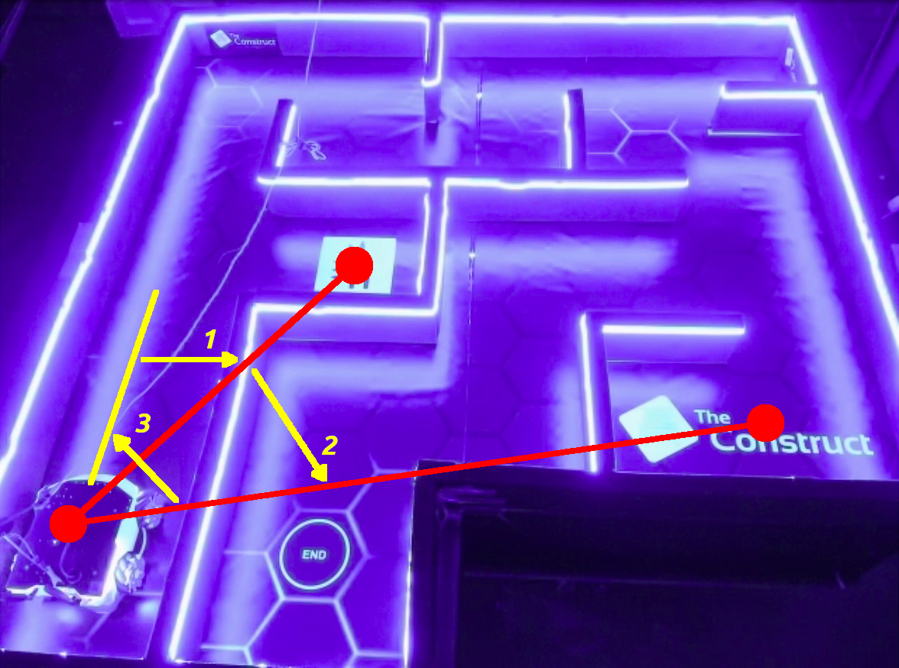

# Checkpoint 17 — Turn Controller

ROS 2 C++ **PID yaw controller** for the **Husarion ROSBot XL**. The node drives the robot through a chain of relative yaw deltas by running a **PD controller with filtered derivative and conditional anti-windup** on the angular error between the accumulated goal heading and the yaw extracted from the EKF-fused odometry. It outputs a pure-rotation `geometry_msgs/Twist` (`angular.z` only, linear channels held at zero) on `/cmd_vel`. Works against both the Gazebo simulation and the real CyberWorld ROSBot XL — the waypoint list is selected from a **scene number** passed as a CLI argument, and the **CyberWorld scene is the default**.

<p align="center">
  
</p>

## How It Works

<p align="center">
  
</p>

### Control Loop

1. A single-node executable `turn_controller` subscribes to `/odometry/filtered` (`nav_msgs/Odometry`) and publishes `geometry_msgs/Twist` on `/cmd_vel`. A `50 ms` wall-timer drives the control loop (20 Hz)
2. `odomCallback` extracts the current yaw `φ` from the pose quaternion via `tf2::impl::getYaw`
3. On construction, `SelectWaypoints()` loads the yaw sequence for the requested scene (scene `2` is the default when no CLI argument is given)
4. On each waypoint change, the target heading is **latched once**: `target_yaw = wrapPi(current_yaw + dphi)`. The PID state (error history, integral, filtered derivative, last-tick clock) is reset so no stale state leaks between segments
5. Per tick:
   - `dt` is measured with `rclcpp::Clock(RCL_ROS_TIME)` and clamped to `[1 ms, 200 ms]` to survive startup gaps
   - Wrapped error `e_φ = wrapPi(target_yaw − current_yaw)`
   - Raw derivative `d_raw = (e_φ − prev_e_φ) / dt`, passed through a **first-order low-pass filter** `d_filt = α·d_raw + (1−α)·d_filt_prev` with `α = 0.2`
   - Unsaturated command `ω = Kp·e_φ + Kd·d_filt + Ki·∫e_φ dt`
   - Saturation to `±max_ang_vel` (`0.9 rad/s`)
   - **Conditional anti-windup**: integral is updated (and clamped to `±int_limit`) **only** when the command is not pushing further into saturation in the same sign as the error. With `Ki = 0` in the current tuning, the integral branch is effectively dormant — kept in the code path so the structure is ready if you need to re-enable I-action
6. Acceptance: `|e_φ| < 0.03 rad` → publish a zero-twist, mark the waypoint reached, start a **2 s pause**; the next waypoint latches a fresh target yaw when the pause ends
7. After the final waypoint, `stopRobot()` publishes five zero-twists to guarantee the robot settles, then `rclcpp::shutdown()` is called

### PID Configuration

| Parameter | Value |
|---|---|
| `Kp` | `1.5`  |
| `Ki` | `0.0` (integral dormant by design) |
| `Kd` | `0.10` |
| Derivative filter `α` | `0.2` |
| Integral clamp `int_limit_` | `0.5` |
| Max angular speed `max_ang_vel_` | `0.9 rad/s` |
| Yaw tolerance `yaw_tol_` | `0.03 rad` (~`1.72°`) |
| Control period | `50 ms` (20 Hz) |
| Inter-waypoint pause | `2.0 s` |

## Waypoint Scenes

Waypoints are `(dx, dy, dphi)` triplets — only `dphi` is consumed by this node; `dx` and `dy` are always `0`. Yaw deltas are **in the body frame** and accumulate relative to the yaw measured when the segment starts.

### Scene 1 — Simulation (`scene_number = 1`)

```
dφ = -0.9120, +0.7576, +0.8504  (rad)
```

Net yaw: `+0.6960 rad` (`+39.9°`)

### Scene 2 — CyberWorld, default (`scene_number = 2`)

```
dφ = -0.5350, -0.7950, +1.3110  (rad)
```

Net yaw: `−0.019 rad` (~`0` — returns to the original heading, giving a closed-loop drift check)

## Real Robot Deployment (CyberWorld)

<p align="center">
  
</p>

The same executable runs **unmodified** on the real Husarion ROSBot XL in The Construct's **CyberWorld** lab. Scene `2` is the default, so launching without any argument already runs the physical-robot yaw sequence:

1. The ROSBot XL real-robot stack (`rosbot_xl_ros` + EKF + wheel controllers) runs on the physical robot; `/odometry/filtered` is streamed to the development machine
2. Launch the controller locally — either explicit or with the default:

   ```bash
   ros2 run turn_controller turn_controller        # defaults to scene 2
   ros2 run turn_controller turn_controller 2      # explicit
   ```
3. `tf2::impl::getYaw` works identically on real odometry — the EKF publishes the same `nav_msgs/Odometry` contract
4. Real-robot tuning choices that matter:
   - **Filtered D-term** (`α = 0.2`) kills the high-frequency jitter that an unfiltered derivative picks up from the real IMU/odom fusion
   - **Conditional anti-windup** protects the integrator while the command is saturated — important when `Ki` is eventually re-enabled for sustained biases
   - `yaw_tol = 0.03 rad` (~`1.72°`) is chattering-safe on the real robot at `0.9 rad/s` cap — the earlier `0.01 rad` tolerance caused oscillation around the goal
   - The `−0.535, −0.795, +1.311 rad` sequence sums to `~0` so any accumulated drift is immediately visible at the end of the run

### Sim ↔ real parity

| Concern | Simulation (scene 1) | Real CyberWorld (scene 2, default) |
|---|---|---|
| Feedback topic | `/odometry/filtered` | `/odometry/filtered` |
| Turn sequence | `-0.912, +0.7576, +0.8504 rad` | `-0.535, -0.795, +1.311 rad` |
| Net yaw | `+0.696 rad` | `≈ 0 rad` (returns to start) |
| PID gains | `Kp=1.5, Ki=0.0, Kd=0.10` | `Kp=1.5, Ki=0.0, Kd=0.10` (unchanged) |
| Tolerance | `0.03 rad` | `0.03 rad` |
| Clock | sim time | wall clock |

## ROS 2 Interface

| Name | Type | Description |
|---|---|---|
| `/odometry/filtered` | `nav_msgs/Odometry` (sub) | EKF-fused odometry consumed as yaw feedback |
| `/cmd_vel` | `geometry_msgs/Twist` (pub) | Pure rotation command (`angular.z`, linear channels zeroed) |

## Project Structure

```
turn_controller/
├── src/
│   └── turn_controller.cpp
├── include/
├── media/
├── CMakeLists.txt
└── package.xml
```

## How to Use

### Prerequisites

- ROS 2 Humble
- Gazebo (bundled with the `rosbot_xl_gazebo` simulation)
- `tf2`, `nav_msgs`, `geometry_msgs`
- `rosbot_xl_ros` stack in the same workspace (description + controllers + EKF)

### Build

```bash
cd ~/ros2_ws
colcon build --packages-select turn_controller --symlink-install
source install/setup.bash
```

### Simulation

```bash
# Terminal 1 — ROSBot XL in Gazebo
ros2 launch rosbot_xl_gazebo simulation.launch.py

# Terminal 2 — PID turn controller (scene 1 = simulation yaw set)
ros2 run turn_controller turn_controller 1
```

### Real robot (CyberWorld)

```bash
ros2 run turn_controller turn_controller        # scene 2 is the default
ros2 run turn_controller turn_controller 2      # or explicit
```

### Sanity checks

```bash
ros2 topic echo /cmd_vel
ros2 topic echo /odometry/filtered
```

## Key Concepts Covered

- **PD with filtered derivative**: first-order low-pass on the discrete derivative (`α = 0.2`) to tame sensor noise
- **Conditional anti-windup**: the integrator only accumulates when the command is not saturated in the same direction as the error — robust even with `Ki = 0` in place for future tuning
- **Per-segment state reset**: error, integral, filtered derivative, and last-tick clock are zeroed on every waypoint change
- **Measured `dt`**: `rclcpp::Clock` sampled per tick and clamped to `[1 ms, 200 ms]` — survives startup hiccups and long-pause resumptions
- **Yaw from quaternion**: `tf2::impl::getYaw` on the EKF pose quaternion
- **Angle wrapping**: `wrapPi` via `atan2(sin, cos)` keeps both target and error inside `[−π, π]` so accumulated yaw never drifts outside the valid range
- **Default scene = real**: omitting the CLI argument runs the CyberWorld sequence — matching the checkpoint's "real-robot first" posture
- **Pure rotation command**: zero linear channels so the holonomic platform rotates in place

## Technologies

- ROS 2 Humble
- C++ 17 (`rclcpp`, `nav_msgs`, `geometry_msgs`, `tf2`)
- Husarion ROSBot XL in Gazebo Sim + CyberWorld
