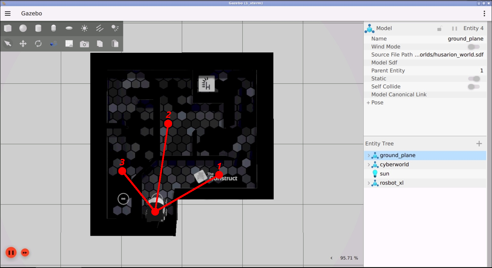
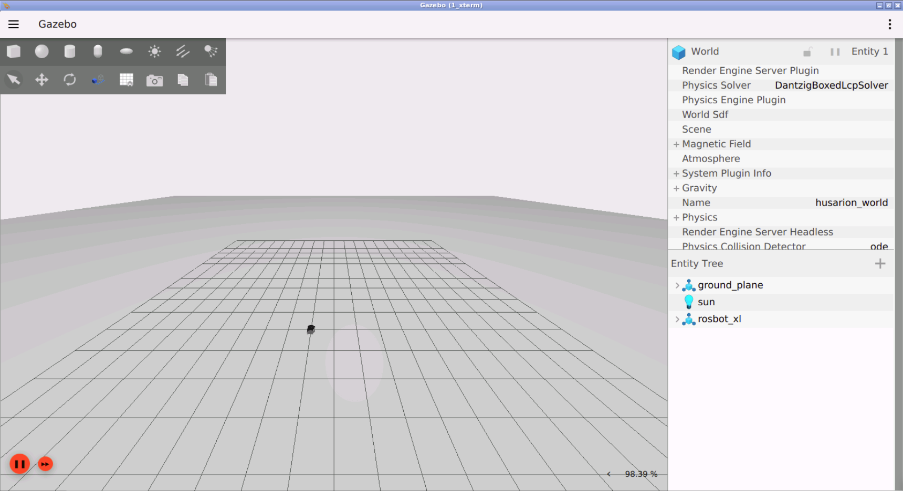

# Checkpoint 17 — Turn Controller

ROS 2 C++ **PID yaw controller** for the **Husarion ROSBot XL**. The node drives the robot through a chain of relative yaw deltas by closing the loop on the **angular error** between the accumulated goal heading and the yaw extracted from the EKF-fused odometry. Outputs a pure-rotation `geometry_msgs/Twist` (`angular.z` only, linear channels held at zero) on `/cmd_vel`. Works against both the Gazebo simulation and the real CyberWorld ROSBot XL — the waypoint list is selected from a **scene number** passed as a CLI argument.

<p align="center">
  
</p>

## How It Works

<p align="center">
  
</p>

### Control Loop

1. A single-node executable `turn_controller` subscribes to `/odometry/filtered` (`nav_msgs/Odometry`) and publishes `geometry_msgs/Twist` on `/cmd_vel`
2. In `odom_callback`, the current yaw `φ` is extracted from the pose quaternion via `tf2::Matrix3x3::getRPY`
3. On construction it calls `select_waypoints(scene_number)` — `1` loads the sim yaw list, `2` loads the CyberWorld list
4. `run()` blocks until a `/cmd_vel` subscriber is connected, then iterates over the `[_, _, dφ]` motion list, accumulating each relative `dφ` into an absolute goal yaw `goal_φ`
5. Per iteration (`25 ms` loop, timed with `std::chrono::steady_clock`):
   - Angular error `e_φ = goal_φ − φ`
   - PID on `e_φ`: `ω = Kp·e_φ + Ki·∫e_φ·dt + Kd·Δe_φ/dt`
   - Clamps: integral wind-up `±1.0`, angular command `±0.4 rad/s`
   - Command published as `(linear.x = 0, linear.y = 0, angular.z = ω)`
6. Exits the per-waypoint loop when `|e_φ| ≤ 0.01 rad`; emits a 0.5 s zero-twist burst (`stop()`) between segments before advancing

### PID Configuration

| Gain | Value |
|------|-------|
| `Kp` | `0.5`  |
| `Ki` | `0.05` |
| `Kd` | `0.1`  |
| Integral clamp `I_MAX` | `1.0`  |
| Max angular speed `W_MAX` | `0.4 rad/s` |
| Angular tolerance `ang_tol` | `0.01 rad` |

## Waypoint Scenes

Both scenes are relative `(_, _, dφ)` triplets — only the third component is consumed:

### Scene 1 — Simulation (`scene_number = 1`)

```
dφ = -1.00, +0.85, +0.70  (rad)
```

### Scene 2 — CyberWorld (`scene_number = 2`)

```
dφ = -0.50, -0.80, +1.30  (rad)
```

## ROS 2 Interface

| Name | Type | Description |
|---|---|---|
| `/odometry/filtered` | `nav_msgs/Odometry` (sub) | EKF-fused odometry consumed as yaw feedback |
| `/rosbot_xl_base_controller/odom` | `nav_msgs/Odometry` | Raw wheel odometry (alternate, commented in source) |
| `/cmd_vel` | `geometry_msgs/Twist` (pub) | Pure rotation command (`angular.z`, linear channels zeroed) |

## Project Structure

```
turn_controller/
├── src/
│   └── turn_controller.cpp
├── include/
├── media/
├── CMakeLists.txt
└── package.xml
```

## How to Use

### Prerequisites

- ROS 2 Humble
- Gazebo (bundled with the `rosbot_xl_gazebo` simulation)
- `tf2`, `nav_msgs`, `geometry_msgs`
- `rosbot_xl_ros` stack in the same workspace (description + controllers + EKF)

### Build

```bash
cd ~/ros2_ws
colcon build --packages-select turn_controller --symlink-install
source install/setup.bash
```

### Simulation

```bash
# Terminal 1 — ROSBot XL in Gazebo
ros2 launch rosbot_xl_gazebo simulation.launch.py

# Terminal 2 — PID turn controller (scene 1 = simulation yaw set)
ros2 run turn_controller turn_controller 1
```

### Real robot (CyberWorld)

```bash
ros2 run turn_controller turn_controller 2
```

### Sanity checks

```bash
ros2 topic echo /cmd_vel
ros2 topic echo /odometry/filtered
```

## Key Concepts Covered

- **PID on heading error**: integral wind-up clamp, discrete derivative term, command saturation
- **Yaw from quaternion**: `tf2::Quaternion` → `tf2::Matrix3x3::getRPY` to get a usable Euler yaw
- **Real-time timing**: `std::chrono::steady_clock` for `dt`, 25 ms control period
- **Scene switching via CLI**: same executable drives sim and real robot by selecting a waypoint table
- **Pure rotation command**: zero linear channels so the holonomic platform rotates in place

## Technologies

- ROS 2 Humble
- C++ 17 (`rclcpp`, `nav_msgs`, `geometry_msgs`, `tf2`)
- Husarion ROSBot XL in Gazebo Sim + CyberWorld
